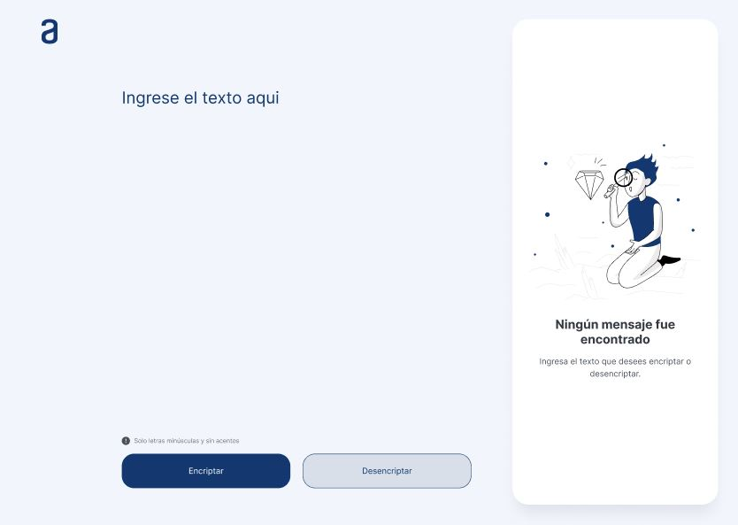

  <h1 align="center">
    Challenge final de Alura
  </h1>
  
Proyecto final de programa Alura realizado con Javascript, HTML y CSS.

  
  

# Sobre ONE - Oracle Next Education

ONE es un programa de educación, y empleabilidad con el objetivo social de capacitar personas en tecnología y conectarlas con el mercado de trabajo a través de las empresas asociadas. Como alumna de este programa cumplí con la primera etapa de los cursos que finalizaba con la realización de un challenge que abordaba todos los temas vistos en clase.

## Resolviendo el Challenge "Encriptador"

Para la realización de este proyecto nos facilitaron material diverso:

1. Acceso a cursos sobre HTML, CSS  y Javascript

2. Una plantilla de Figma para guiarnos en el diseño del aplicativo web

3. Un tablero de Trello donde se desglosaban las tareas a realizar en el proyecto y con los plazos establecidos.

## Principales retos

Las funciones más importantes fueros encriptar y desencriptar el texto. Pero hubo otros retos en el manejo de la lógica del programa y estados como:

- **Limpieza de texto en inputs**

> Fue una de las tareas que más me costó implementar para que los botones no se trabaran o interfirieran entre ellos. Para esto usé variables auxiliares y pueden revisarlo en el archivo "app.js" del proyecto que está con la debida documentación.

- **Cambio de la aplicación dependiendo de ciertas acciones**

> El manejo del DOM para este proyecto fue algo que no lo tenía tan claro por lo que tuve que investigar en sitios web.

- **Restricción del texto**

> Verificar que el texto esté en minúsculas y sin tildes también fue algo que debí investigar.
